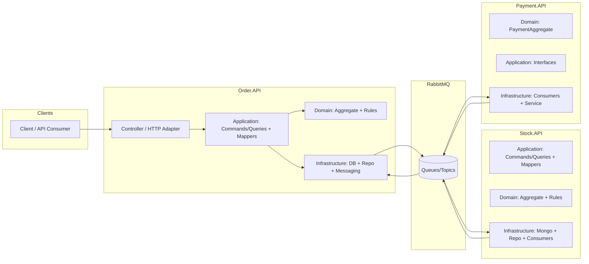

  <h1>MicroservisApp — Order / Stock / Payment</h1>
  
<b>DDD</b> + <b>Clean Architecture</b> + <b>EDA</b> (RabbitMQ/MassTransit) + <b>Result Pattern</b>, CQRS optional

  

    
    
    
    
  

***

## Contents

- [Quick links](#quick-links)
- [Azərbaycan dili](#azərbaycan-dili)
- [English](#english)

***

## Quick links

- Architecture: [docs/cqrs-dispatching.md](docs/cqrs-dispatching.md)
- CI: [ci-cqrs.yml](.github/workflows/ci-cqrs.yml), [ci-no-cqrs.yml](.github/workflows/ci-no-cqrs.yml)
- Services: [Order.API](src/Order.API), [Stock.API](src/Stock.API), [Payment.API](src/Payment.API)

***

## Azərbaycan dili

### Məqsəd

Bu repo **Order**, **Stock**, **Payment** mikroservisləri üzərində “production-ready” arxitektura nümayişidir:

- Biznes məntiqini domain-də saxlamaq (DDD), use-case-ləri tətbiq qatında modelləmək (Clean Architecture).
- Servislərarası əlaqəni event-driven şəkildə qurmaq (EDA) və coupling-i azaltmaq.
- Error handling-i standartlaşdırmaq (Result pattern + `DomainError`).
- CQRS/MediatR-dan asılılığı opsional etmək: CQRS söndürülsə belə sistem compile/runtime problem olmadan işləsin.

### Mündəricat

- [Yüksək səviyyə diaqram](#yüksək-səviyyəli-arxitektura-diaqramı)
- [Repo strukturu](#repo-strukturu)
- [Texnologiyalar](#istifadə-olunan-texnologiyalar-və-seçim-səbəbləri)
- [Design pattern-lər və qərarlar](#design-pattern-lər-və-arxitektura-qərarları)
- [Scalability](#miqyaslana-bilərlik-scalability)
- [Security](#təhlükəsizlik-yanaşmaları)
- [Performance](#performans-optimizasiyaları)
- [Testing](#testing-strategiyası)
- [CI/CD](#cicd-pipeline)
- [Deployment](#deployment-prosesi-repo-vəziyyətinə-uyğun)
- [Monitoring & Logging](#monitorinq-və-logging)
- [Risklər](#potensial-risklər-və-idarə-olunması)
- [Alternativlər](#alternativlər-qısa-analiz)

### Yüksək səviyyəli arxitektura diaqramı

### Repo strukturu

- `src/Order.API` — HTTP adapter, domain, infra (SQL Server), integration consumers
- `src/Stock.API` — domain, infra (MongoDB), integration consumer (order-created)
- `src/Payment.API` — domain, infra consumer (stock-reserved), service layer
- `src/Shared` — cross-cutting: errors, CQRS abstractions, dispatching abstraction, integration events/messages
- `src/*.Tests` — unit/regression testlər
- `.github/workflows` — iki CI konfiqurasiyası (CQRS var/yox)

### İstifadə olunan texnologiyalar (və seçim səbəbləri)

- **.NET 9 / ASP.NET Core**: performans, modern hosting, standart middleware/logging.
- **MassTransit + RabbitMQ**: integration event publish/consume üçün battle-tested EDA stack.
- **Entity Framework Core (Order)**: relational model və transaction-lar üçün.
- **MongoDB.Driver (Stock)**: simple document model, stock read/write üçün sürətli repository.
- **MediatR (opsional)**: CQRS handler-ləri üçün; ancaq sistem bununla məcburi bağlı deyil.
- **CSharpFunctionalExtensions Result**: success/failure axınını standartlaşdırmaq, exception-ı yalnız “truly exceptional” hallarda saxlamaq.
- **FluentValidation**: request validation-i pipeline behavior səviyyəsində etmək.
- **xUnit + Moq**: unit test və mocking.

### Design pattern-lər və arxitektura qərarları

- **Clean Architecture (Domain/Application/Infrastructure/Presentation)**:
  - Domain: business rules + invariant-lar.
  - Application: use-case adapterləri (commands/queries), mapping/transform.
  - Infrastructure: DB, messaging, repository implementasiyaları.
  - Presentation: HTTP controller-lər.
- **Repository pattern**:
  - Repository interfeysləri domain-dədir; implementasiya infra-da.
  - Repository-lər domain model-lərlə işləyir, DB model ayrı saxlanır (mapping infra-da).
- **Result pattern + DomainError**:
  - Controller və adapterlər status code mapping-i error type-ə görə edir.
- **CQRS “opsional” dizaynı**:
  - Controller-lər birbaşa `IMediator`-a bağlı deyil, `IRequestDispatcher` abstraksiyasına bağlıdır.
  - `UseCqrs=true` → MediatR dispatcher.
  - `UseCqrs=false` → direct dispatcher (MediatR-siz).
  - Ətraflı: `docs/cqrs-dispatching.md`.

### Miqyaslana bilərlik (Scalability)

- Servislərin ayrılması: compute və storage ayrı miqyaslana bilir.
- Async messaging: sync coupling azalır, spike-lar queue-lar ilə “buffer” olunur.
- Read/write load separation (səviyyəli): CQRS aktiv olduqda handler-lərdən istifadə edilir; söndürüləndə də eyni use-case flow saxlanır.

### Təhlükəsizlik yanaşmaları

- **Əsas qayda**: config fayllarında real secret saxlamayın; environment variable / secret manager istifadə edin.
- Transport səviyyəsi: HTTPS redirection mövcuddur.
- AuthN/AuthZ: bu repo “architecture showcase” fokusludur; production üçün JWT/OAuth2, API gateway və policy-based authorization tövsiyə olunur.

### Performans optimizasiyaları

- “Lean handler”: handler-lər orchestration saxlayır, core business qərarlar service/domain-da qalır.
- Mapping-i lokallaşdırmaq: infra repository mapping edir, application response mapping edir.
- Async I/O: DB və messaging call-lar async saxlanılır.

### Testing strategiyası

- **Domain testləri**: aggregate/value object invariant-ları.
- **Service layer testləri**: repository/dispatcher mock-lanaraq use-case behavior yoxlanılır.
- **CQRS regression**: `UseCqrs=false` ilə testlər də keçməlidir (CQRS çıxarılanda sistemin işləməsini simulyasiya edir).

### CI/CD pipeline

GitHub Actions iki workflow ilə işləyir:

- CQRS ilə: `.github/workflows/ci-cqrs.yml`
- CQRS-siz: `.github/workflows/ci-no-cqrs.yml`

Hər ikisi build + bütün testləri qaçırır.

### Deployment prosesi (repo vəziyyətinə uyğun)

Bu repo docker/k8s manifestləri daşımır. Deployment üçün tipik yanaşma:

- `dotnet publish` ilə artefakt çıxarılması
- `RabbitMQ` connection, `SQL Server`, `MongoDB` connection string-lərin secret store-dan inject edilməsi
- `UseCqrs` flag-ı deployment profilinə görə seçilməsi

### Monitorinq və logging

- `ILogger` üzərindən structured logging.
- Pipeline behavior-lar ilə request logging/validation mərkəzləşdirilir.
- Production üçün tövsiyə: OpenTelemetry trace/metrics + central log sink (Seq/ELK).

### Potensial risklər və idarə olunması

- **Eventual consistency**: EDA-də state “sonradan” uyğunlaşa bilər. Risk mitigation: idempotent consumer-lər, retry/dlq, correlation id.
- **Secret leakage**: repo-ya secret commit etmək kritik riskdir. Mitigation: secret scanning + rotation + env-based config.
- **Schema drift**: integration event contract dəyişiklikləri. Mitigation: versioning, backward compatibility.

### Alternativlər (qısa analiz)

- CQRS olmadan: daha sadə flow, daha az moving part; bu repo buna “UseCqrs=false” ilə hazırdır.
- EDA yerinə sync HTTP: sadə başlama, amma coupling və latency riskləri daha çox.
- Result pattern yerinə exception-driven flow: daha az kod, amma error mapping və observability standartlaşması çətinləşir.

***

## English

### Project goal

This repository is a **production-minded architecture showcase** for three microservices (**Order**, **Stock**, **Payment**) with the following goals:

- Keep business rules inside the domain (DDD) and model use-cases cleanly (Clean Architecture).
- Reduce coupling via event-driven integration (EDA).
- Standardize error handling (Result pattern + `DomainError`).
- Make CQRS optional: the system must continue working without compile/runtime failures when CQRS is disabled or removed.

### Table of contents

- [High-level diagram](#high-level-architecture-diagram)
- [Technology stack](#technology-stack-and-why)
- [Patterns & decisions](#patterns--key-decisions-with-alternatives)
- [Scalability](#scalability)
- [Security](#security-posture)
- [Performance](#performance)
- [Testing](#testing-strategy)
- [CI/CD](#cicd)
- [Deployment](#deployment-as-is)
- [Monitoring & logging](#monitoring--logging)
- [Risks](#risks--mitigation)

### High-level architecture diagram

### Technology stack (and why)

- **.NET 9 / ASP.NET Core**: modern hosting, performance, built-in middleware/logging.
- **MassTransit + RabbitMQ**: mature EDA stack for publishing/consuming integration events.
- **EF Core (Order)**: relational data model and transactions.
- **MongoDB.Driver (Stock)**: document store for stock operations.
- **MediatR (optional)**: CQRS handlers; the core design does not depend on it.
- **CSharpFunctionalExtensions Result**: consistent success/failure flows and error mapping.
- **FluentValidation**: centralized validation via pipeline behaviors.
- **xUnit + Moq**: unit testing and mocking.

### Patterns & key decisions (with alternatives)

- **Clean Architecture**: Domain/Application/Infrastructure/Presentation separation.
- **Repository pattern**: domain interfaces, infra implementations; domain ↔ persistence mapping stays in infra.
- **Result + DomainError**: consistent API error surface.
- **Optional CQRS**:
  - Controllers depend on `IRequestDispatcher`, not on `IMediator`.
  - `UseCqrs=true` → MediatR dispatcher.
  - `UseCqrs=false` → direct dispatcher (no MediatR required at runtime).
  - See: `docs/cqrs-dispatching.md`.

### Scalability

- Independent scaling per microservice (compute/storage).
- Async messaging buffers load spikes and reduces synchronous coupling.

### Security posture

- Do not store secrets in config files; use environment variables / secret managers.
- HTTPS redirection is enabled.
- Authentication/authorization is intentionally minimal in this showcase; production should use JWT/OAuth2, gateway, and policy-based authorization.

### Performance

- Lean handlers: orchestration in adapters, business rules in domain/services.
- Async I/O for DB and messaging calls.

### Testing strategy

- Domain tests for invariants.
- Service tests with mocked repositories.
- Regression coverage for “CQRS disabled” mode (`UseCqrs=false`).

### CI/CD

Two GitHub Actions workflows:

- With CQRS: `.github/workflows/ci-cqrs.yml`
- Without CQRS: `.github/workflows/ci-no-cqrs.yml`

Both run build + full test suite.

### Deployment (as-is)

This repo does not include Docker/K8s manifests. A typical deployment approach:

- `dotnet publish` per service
- Inject `RabbitMQ`, `SQL Server`, `MongoDB` settings via secret store
- Select `UseCqrs` per environment

### Monitoring & logging

- Structured logging via `ILogger`.
- Pipeline behaviors centralize request logging/validation.
- Recommended extension: OpenTelemetry traces/metrics + centralized log storage (Seq/ELK).

### Risks & mitigation

- Eventual consistency → idempotent consumers, retries/DLQ, correlation IDs.
- Secret leakage → secret scanning, rotation, env-based config.
- Contract drift → versioning and backward compatible integration events.

